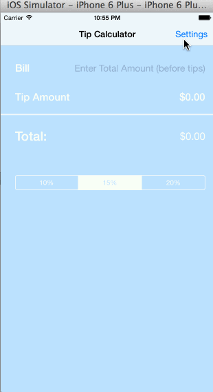

TipCalculator
=============
#Description
This is a very simple tip calculator developed during an iOS/ Objective-C course sponsored by Box. It is my first mobile app ever, and first time using Objective-C. It is a bit more challenging that I expected, but I am very excited about the opportunity to embrace new things!

#FAQ
How many hours did it take to complete?
About 13 hours:
- 2 hours just to figure out the differences between the latest version of Xcode and the older version used in the [video walkthrough](https://vimeo.com/74764846)
- an hour building the main view
- 2 hours building the settings view
- 3 hours adding a pickerView (it's surprisingly hard to find a good tutorial on this)
- 2 hours polishing the UI and adding comments to the code
- 2 hours reading instructions and writing the README file
- 1 hour to fix bugs related to wrong reference errors

Which required and optional stories have you completed?
- Main view, settings view, data storing using standardUserDefaults.
- Animation will be completed in the next week.

